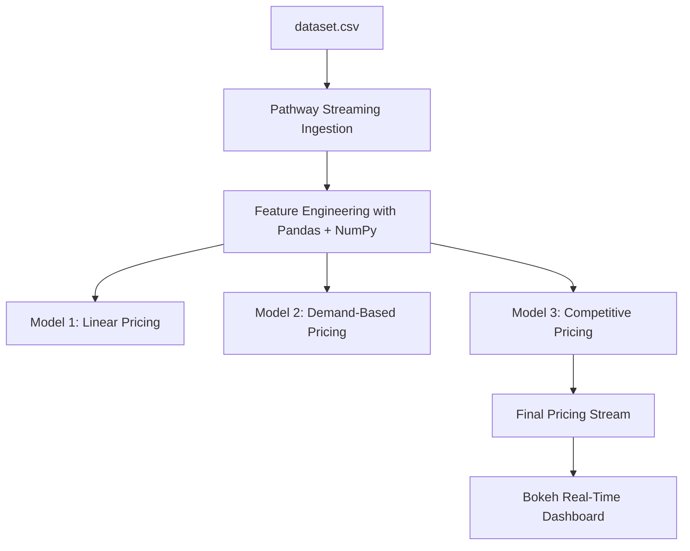
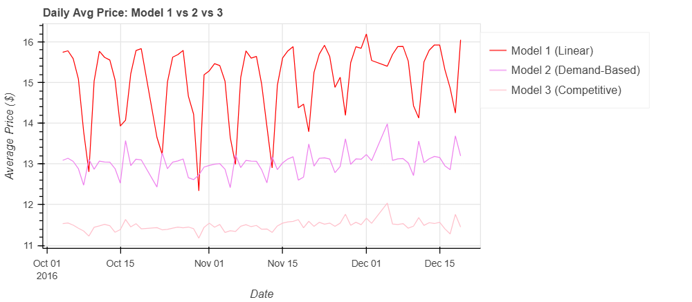
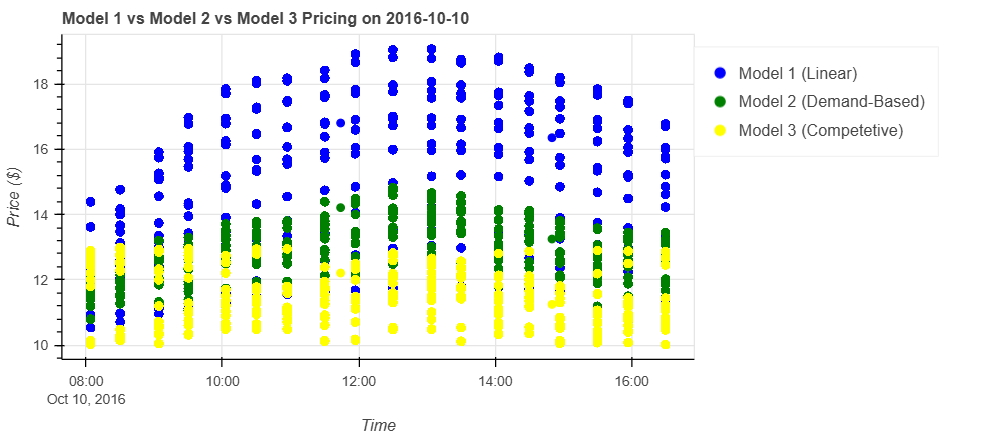
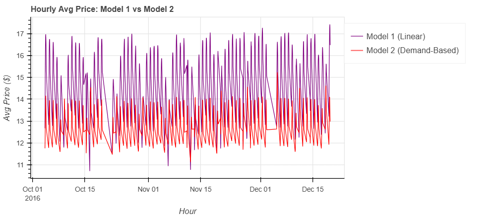

# ATV2006_SA_Capstone_Project

#Dynamic Pricing for Urban Parking Lots

> **Capstone Project – Summer Analytics 2025**  
> *Hosted by: Consulting & Analytics Club × Pathway*

---

## Overview

Urban parking spaces are scarce and in constant demand. Static pricing leads to inefficiencies such as overcrowding or underutilization. Our goal is to build an **intelligent, real-time pricing engine** that dynamically adjusts parking prices for 14 lots using features like traffic, occupancy, and competition.

All pricing models are implemented from scratch using **Numpy**, **Pandas**, and **Pathway** — with no external ML libraries — to simulate and respond to live data streams.

---

## Tech Stack Used

| Category              | Tools / Libraries      |
|-----------------------|------------------------|
| Programming Language  | Python                 |
| Data Processing       | Pandas, Numpy          |
| Real-Time Streaming   | Pathway                |
| Visualization         | Bokeh                  |
| Deployment Environment| Google Colab           |
| Diagram Tool          | Mermaid Live Editor    |

---

## Architecture Diagram



---

## Detailed Architecture Explanation

This system is designed to simulate a real-time dynamic pricing engine for parking lots. Here's a breakdown of each stage in the architecture:

### 1. dataset.csv — Input Data  
This is a time-series dataset containing simulated parking lot information over 73 days. Each entry includes:
- Timestamp  
- Lot ID  
- Occupancy  
- Capacity  
- Queue Length  
- Latitude & Longitude  
- Traffic Congestion  
- Special Day Indicator  
- Vehicle Type  

---

### 2. Pathway Streaming Ingestion  
We simulate real-time data ingestion using Pathway, which:
- Reads `dataset.csv` in time-stamped order  
- Streams rows with simulated delays to mimic real-world flow  
- Maintains real-time ordering of events  

Each data point is treated as a new "event" entering the system, allowing us to compute live prices.

---

### 3. Feature Engineering (Pandas + Numpy)  
Using `pandas` and `numpy`, we compute and normalize the following features:
- **Occupancy Ratio**: `occupancy / capacity`  
- **Queue Length**: raw value from dataset  
- **Traffic Level**: congestion intensity (higher = lower demand)  
- **Special Day**: binary flag (1 if holiday/event)  
- **Vehicle Type Weight**: car, bike, truck weights from lookup  

These features form the **input to our demand functions**.

---

### 4. Model 1: Linear Pricing  
The first model is a naive baseline:
```python
price_t+1 = price_t + α × (occupancy / capacity)
```
- Price increases linearly as lot fills up.  
- Acts as a sanity check and baseline comparison.

---

###  5. Model 2: Demand-Based Pricing  
We construct a **demand function**:
```python
demand = α × (occupancy/capacity) + β × queue
         - γ × traffic + δ × special_day + ε × vehicle_type_weight
```
Then calculate the price as:
```python
price = base × (1 + λ × normalized_demand)
```
- Demand is normalized between 0 and 1  
- Prices are bounded between 0.5x and 2x base price  
- Smoother and more realistic than Model 1

---

###  6. Model 3: Competitive Pricing (Optional)  
This model adds **geospatial intelligence**:
- Computes Haversine distance between parking lots using latitude/longitude  
- Compares own price and occupancy to nearby lots  
- Adjusts price accordingly:
  - Lower price if nearby lots are cheaper  
  - Suggest rerouting if own lot is full  
  - Increase price if others are full/expensive  

This simulates **real-world business behavior**.

---

### 7. Final Pricing Stream  
The output price is emitted as a real-time stream using:
```python
pw.io.jsonlines.write()
```
Each output includes:
- Lot ID  
- Timestamp  
- Final computed price  
- (Optionally) nearby competitor influence  

---

### 8. Bokeh Real-Time Dashboard  
Live visualizations are generated using **Bokeh**, including:
- **Price vs Time** line charts for each lot  
- **Competitor comparison** plots  
- **Interactive elements** for zoom/filter  

These help explain and justify the behavior of the dynamic pricing engine.

---

##  Pricing Models Overview

###  Model 1: Linear Baseline
```python
Price_t+1 = Price_t + α × (Occupancy / Capacity)
```

###  Model 2: Demand-Based Pricing
```python
Demand = α·(Occupancy/Capacity) + β·Queue − γ·Traffic + δ·SpecialDay + ε·VehicleWeight  
Price_t = Base × (1 + λ·NormalizedDemand)
```

###  Model 3: Competitive Pricing
- Adds geo-distance and competitor prices  
- Smart adjustments based on surroundings  
- Encourages price competitiveness and fairness  

---

## Visualization Snapshots

| Plot Type                   | Tool   | Description                            |
|-----------------------------|--------|----------------------------------------|
| Real-time pricing per lot   | Bokeh  | See how prices shift with demand       |
| Competitor price comparison | Bokeh  | Validate effectiveness of competition  |
| Time-based trend graphs     | Bokeh  | Track evolution of each lot’s pricing  |

---



---
##  Assumptions

- Base price is fixed at **$10**  
- Price bounds: **[$5, $20]**  
- Vehicle weights: **truck > car > bike**  
- Distance threshold for competitor lots: **2 km**  
- Special events **positively affect** demand  
- No external ML libraries used  

